# Ripple Architecture

Visual architecture diagrams and system design documentation.

---

## System Architecture

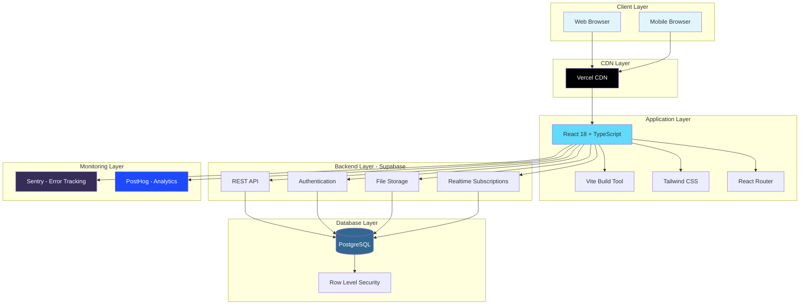
```mermaid
graph TB
    subgraph "Client Layer"
        Browser[Web Browser]
        Mobile[Mobile Browser]
    end

    subgraph "CDN Layer"
        Vercel[Vercel CDN]
    end

    subgraph "Application Layer"
        React[React 18 + TypeScript]
        Vite[Vite Build Tool]
        TailwindCSS[Tailwind CSS]
        Router[React Router]
    end

    subgraph "Backend Layer - Supabase"
        API[REST API]
        Auth[Authentication]
        Storage[File Storage]
        Realtime[Realtime Subscriptions]
    end

    subgraph "Database Layer"
        PostgreSQL[(PostgreSQL)]
        RLS[Row Level Security]
    end

    subgraph "Monitoring Layer"
        Sentry[Sentry - Error Tracking]
        PostHog[PostHog - Analytics]
    end

    Browser --> Vercel
    Mobile --> Vercel
    Vercel --> React
    React --> Vite
    React --> TailwindCSS
    React --> Router
    React --> API
    React --> Auth
    React --> Storage
    React --> Realtime
    API --> PostgreSQL
    Auth --> PostgreSQL
    Storage --> PostgreSQL
    Realtime --> PostgreSQL
    PostgreSQL --> RLS
    React --> Sentry
    React --> PostHog

    style Browser fill:#e1f5ff
    style Mobile fill:#e1f5ff
    style Vercel fill:#000000,color:#ffffff
    style React fill:#61dafb
    style PostgreSQL fill:#336791,color:#ffffff
    style Sentry fill:#362d59,color:#ffffff
    style PostHog fill:#1d4aff,color:#ffffff
```

---

## Data Flow Architecture

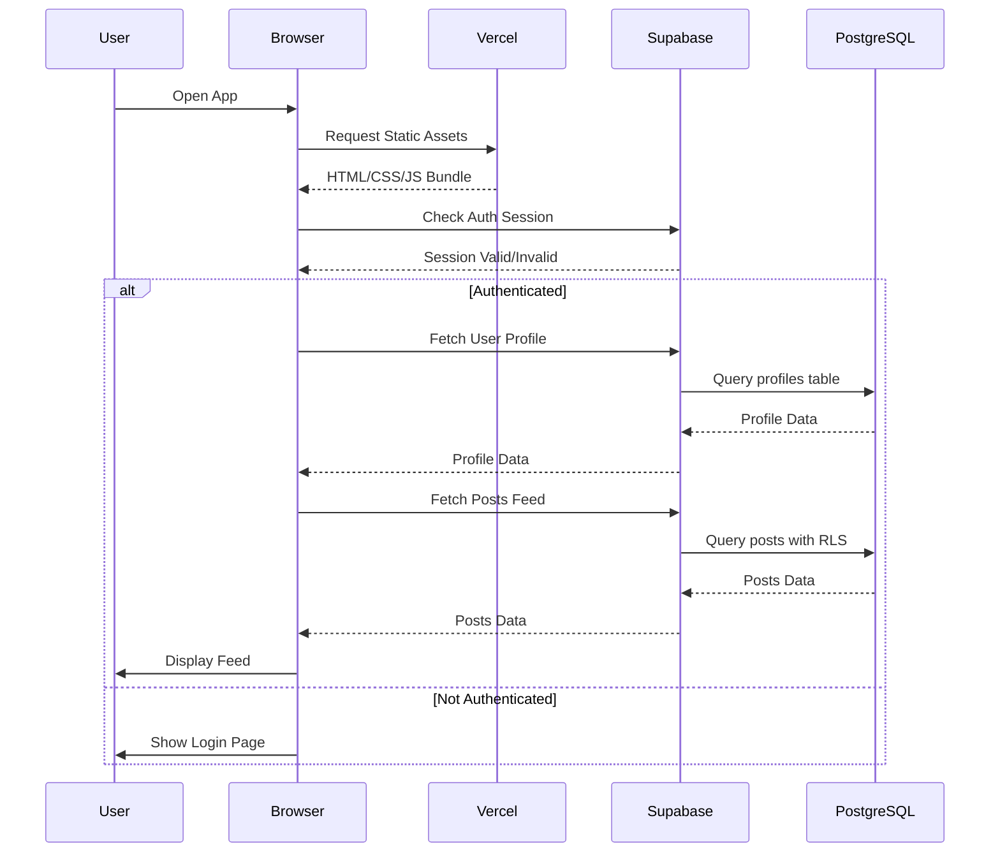
```mermaid
sequenceDiagram
    participant User
    participant Browser
    participant Vercel
    participant Supabase
    participant PostgreSQL

    User->>Browser: Open App
    Browser->>Vercel: Request Static Assets
    Vercel-->>Browser: HTML/CSS/JS Bundle
    Browser->>Supabase: Check Auth Session
    Supabase-->>Browser: Session Valid/Invalid
    
    alt Authenticated
        Browser->>Supabase: Fetch User Profile
        Supabase->>PostgreSQL: Query profiles table
        PostgreSQL-->>Supabase: Profile Data
        Supabase-->>Browser: Profile Data
        Browser->>Supabase: Fetch Posts Feed
        Supabase->>PostgreSQL: Query posts with RLS
        PostgreSQL-->>Supabase: Posts Data
        Supabase-->>Browser: Posts Data
        Browser->>User: Display Feed
    else Not Authenticated
        Browser->>User: Show Login Page
    end
```

---

## Database Schema

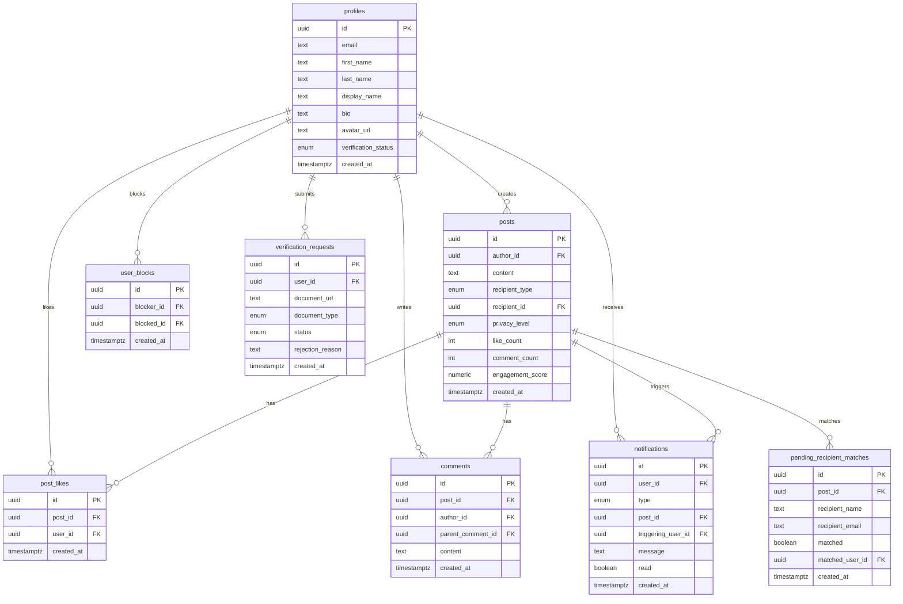
```mermaid
erDiagram
    profiles ||--o{ posts : creates
    profiles ||--o{ post_likes : likes
    profiles ||--o{ comments : writes
    profiles ||--o{ notifications : receives
    profiles ||--o{ user_blocks : blocks
    posts ||--o{ post_likes : has
    posts ||--o{ comments : has
    posts ||--o{ notifications : triggers
    posts ||--o{ pending_recipient_matches : matches
    profiles ||--o{ verification_requests : submits

    profiles {
        uuid id PK
        text email
        text first_name
        text last_name
        text display_name
        text bio
        text avatar_url
        enum verification_status
        timestamptz created_at
    }

    posts {
        uuid id PK
        uuid author_id FK
        text content
        enum recipient_type
        uuid recipient_id FK
        enum privacy_level
        int like_count
        int comment_count
        numeric engagement_score
        timestamptz created_at
    }

    post_likes {
        uuid id PK
        uuid post_id FK
        uuid user_id FK
        timestamptz created_at
    }

    comments {
        uuid id PK
        uuid post_id FK
        uuid author_id FK
        uuid parent_comment_id FK
        text content
        timestamptz created_at
    }

    notifications {
        uuid id PK
        uuid user_id FK
        enum type
        uuid post_id FK
        uuid triggering_user_id FK
        text message
        boolean read
        timestamptz created_at
    }

    pending_recipient_matches {
        uuid id PK
        uuid post_id FK
        text recipient_name
        text recipient_email
        boolean matched
        uuid matched_user_id FK
        timestamptz created_at
    }

    verification_requests {
        uuid id PK
        uuid user_id FK
        text document_url
        enum document_type
        enum status
        text rejection_reason
        timestamptz created_at
    }

    user_blocks {
        uuid id PK
        uuid blocker_id FK
        uuid blocked_id FK
        timestamptz created_at
    }
```

---

## Authentication Flow

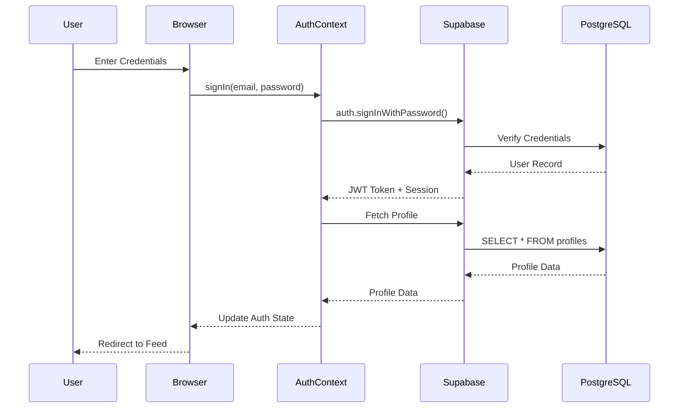
```mermaid
sequenceDiagram
    participant User
    participant Browser
    participant AuthContext
    participant Supabase
    participant PostgreSQL

    User->>Browser: Enter Credentials
    Browser->>AuthContext: signIn(email, password)
    AuthContext->>Supabase: auth.signInWithPassword()
    Supabase->>PostgreSQL: Verify Credentials
    PostgreSQL-->>Supabase: User Record
    Supabase-->>AuthContext: JWT Token + Session
    AuthContext->>Supabase: Fetch Profile
    Supabase->>PostgreSQL: SELECT * FROM profiles
    PostgreSQL-->>Supabase: Profile Data
    Supabase-->>AuthContext: Profile Data
    AuthContext-->>Browser: Update Auth State
    Browser-->>User: Redirect to Feed
```

---

## Post Creation Flow

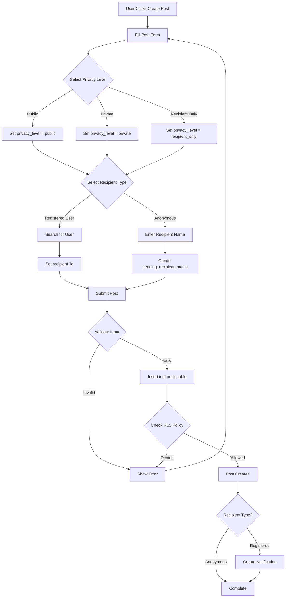
```mermaid
flowchart TD
    Start[User Clicks Create Post] --> Form[Fill Post Form]
    Form --> Privacy{Select Privacy Level}
    Privacy -->|Public| Public[Set privacy_level = public]
    Privacy -->|Private| Private[Set privacy_level = private]
    Privacy -->|Recipient Only| RecipientOnly[Set privacy_level = recipient_only]
    
    Public --> Recipient{Select Recipient Type}
    Private --> Recipient
    RecipientOnly --> Recipient
    
    Recipient -->|Registered User| SearchUser[Search for User]
    Recipient -->|Anonymous| EnterName[Enter Recipient Name]
    
    SearchUser --> SetRecipient[Set recipient_id]
    EnterName --> CreateMatch[Create pending_recipient_match]
    
    SetRecipient --> Submit[Submit Post]
    CreateMatch --> Submit
    
    Submit --> Validate{Validate Input}
    Validate -->|Invalid| Error[Show Error]
    Validate -->|Valid| Insert[Insert into posts table]
    
    Insert --> RLS{Check RLS Policy}
    RLS -->|Denied| Error
    RLS -->|Allowed| Success[Post Created]
    
    Success --> Notify{Recipient Type?}
    Notify -->|Registered| CreateNotification[Create Notification]
    Notify -->|Anonymous| End[Complete]
    
    CreateNotification --> End
    Error --> Form
```

---

## Feed Loading Flow

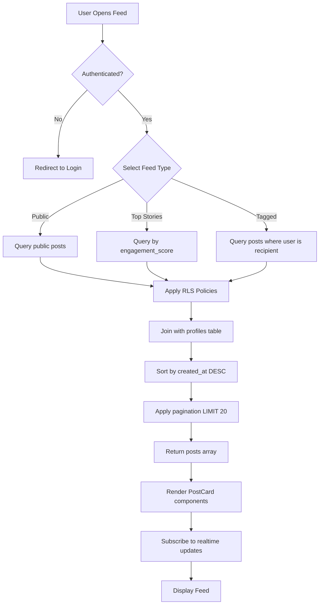
```mermaid
flowchart TD
    Start[User Opens Feed] --> CheckAuth{Authenticated?}
    CheckAuth -->|No| Login[Redirect to Login]
    CheckAuth -->|Yes| FeedType{Select Feed Type}
    
    FeedType -->|Public| QueryPublic[Query public posts]
    FeedType -->|Top Stories| QueryTop[Query by engagement_score]
    FeedType -->|Tagged| QueryTagged[Query posts where user is recipient]
    
    QueryPublic --> ApplyRLS[Apply RLS Policies]
    QueryTop --> ApplyRLS
    QueryTagged --> ApplyRLS
    
    ApplyRLS --> Join[Join with profiles table]
    Join --> Sort[Sort by created_at DESC]
    Sort --> Paginate[Apply pagination LIMIT 20]
    Paginate --> Return[Return posts array]
    
    Return --> Render[Render PostCard components]
    Render --> Subscribe[Subscribe to realtime updates]
    Subscribe --> End[Display Feed]
```

---

## Notification System

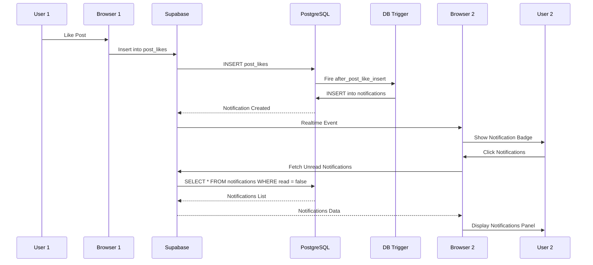
```mermaid
sequenceDiagram
    participant User1 as User 1
    participant Browser1 as Browser 1
    participant Supabase
    participant PostgreSQL
    participant Trigger as DB Trigger
    participant Browser2 as Browser 2
    participant User2 as User 2

    User1->>Browser1: Like Post
    Browser1->>Supabase: Insert into post_likes
    Supabase->>PostgreSQL: INSERT post_likes
    PostgreSQL->>Trigger: Fire after_post_like_insert
    Trigger->>PostgreSQL: INSERT into notifications
    PostgreSQL-->>Supabase: Notification Created
    Supabase->>Browser2: Realtime Event
    Browser2->>User2: Show Notification Badge
    User2->>Browser2: Click Notifications
    Browser2->>Supabase: Fetch Unread Notifications
    Supabase->>PostgreSQL: SELECT * FROM notifications WHERE read = false
    PostgreSQL-->>Supabase: Notifications List
    Supabase-->>Browser2: Notifications Data
    Browser2->>User2: Display Notifications Panel
```

---

## Security Architecture

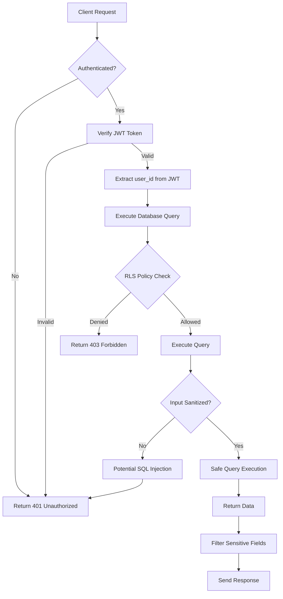
```mermaid
flowchart TD
    Request[Client Request] --> Auth{Authenticated?}
    Auth -->|No| Reject[Return 401 Unauthorized]
    Auth -->|Yes| JWT[Verify JWT Token]
    
    JWT -->|Invalid| Reject
    JWT -->|Valid| ExtractUser[Extract user_id from JWT]
    
    ExtractUser --> Query[Execute Database Query]
    Query --> RLS{RLS Policy Check}
    
    RLS -->|Denied| Reject403[Return 403 Forbidden]
    RLS -->|Allowed| Execute[Execute Query]
    
    Execute --> Sanitize{Input Sanitized?}
    Sanitize -->|No| SQLInjection[Potential SQL Injection]
    Sanitize -->|Yes| Safe[Safe Query Execution]
    
    SQLInjection --> Reject
    Safe --> Return[Return Data]
    
    Return --> Filter[Filter Sensitive Fields]
    Filter --> Response[Send Response]
```

---

## Deployment Pipeline (Planned)

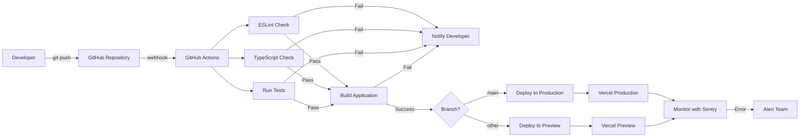
```mermaid
flowchart LR
    Dev[Developer] -->|git push| GitHub[GitHub Repository]
    GitHub -->|webhook| Actions[GitHub Actions]
    
    Actions --> Lint[ESLint Check]
    Actions --> Type[TypeScript Check]
    Actions --> Test[Run Tests]
    
    Lint -->|Pass| Build[Build Application]
    Type -->|Pass| Build
    Test -->|Pass| Build
    
    Lint -->|Fail| Notify[Notify Developer]
    Type -->|Fail| Notify
    Test -->|Fail| Notify
    
    Build -->|Success| Deploy{Branch?}
    Build -->|Fail| Notify
    
    Deploy -->|main| Prod[Deploy to Production]
    Deploy -->|other| Preview[Deploy to Preview]
    
    Prod --> Vercel[Vercel Production]
    Preview --> VercelPreview[Vercel Preview]
    
    Vercel --> Monitor[Monitor with Sentry]
    VercelPreview --> Monitor
    
    Monitor -->|Error| Alert[Alert Team]
```

---

## Component Architecture

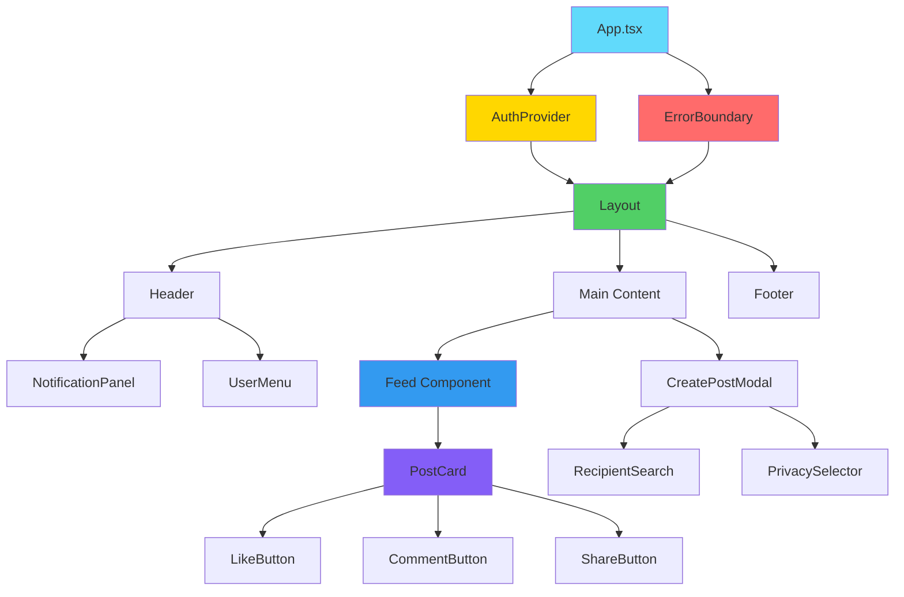
```mermaid
graph TD
    App[App.tsx] --> AuthProvider[AuthProvider]
    App --> ErrorBoundary[ErrorBoundary]
    
    AuthProvider --> Layout[Layout]
    ErrorBoundary --> Layout
    
    Layout --> Header[Header]
    Layout --> MainContent[Main Content]
    Layout --> Footer[Footer]
    
    Header --> NotificationPanel[NotificationPanel]
    Header --> UserMenu[UserMenu]
    
    MainContent --> Feed[Feed Component]
    MainContent --> CreatePost[CreatePostModal]
    
    Feed --> PostCard[PostCard]
    PostCard --> LikeButton[LikeButton]
    PostCard --> CommentButton[CommentButton]
    PostCard --> ShareButton[ShareButton]
    
    CreatePost --> RecipientSearch[RecipientSearch]
    CreatePost --> PrivacySelector[PrivacySelector]
    
    style App fill:#61dafb
    style AuthProvider fill:#ffd700
    style ErrorBoundary fill:#ff6b6b
    style Layout fill:#51cf66
    style Feed fill:#339af0
    style PostCard fill:#845ef7
```

---

## State Management

```mermaid
flowchart TD
    subgraph "Global State"
        AuthContext[AuthContext]
        User[user: User | null]
        Profile[profile: Profile | null]
        Loading[loading: boolean]
    end
    
    subgraph "Component State"
        FeedState[Feed State]
        Posts[posts: Post[]]
        FeedLoading[loading: boolean]
        FeedError[error: string | null]
    end
    
    subgraph "Server State"
        Supabase[Supabase Client]
        Cache[Query Cache]
    end
    
    AuthContext --> User
    AuthContext --> Profile
    AuthContext --> Loading
    
    FeedState --> Posts
    FeedState --> FeedLoading
    FeedState --> FeedError
    
    FeedState --> Supabase
    Supabase --> Cache
    Cache --> FeedState
    
    AuthContext --> Supabase
```

---

## File Upload Flow

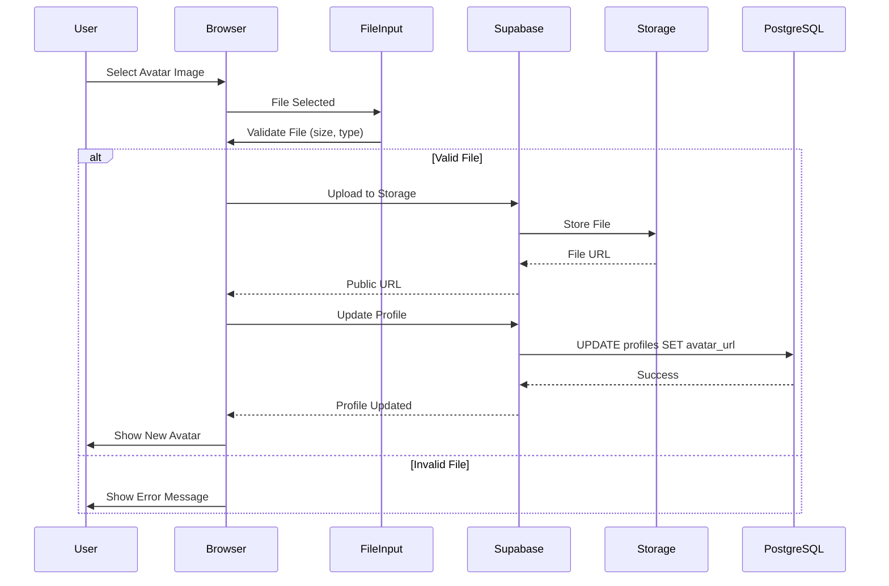
```mermaid
sequenceDiagram
    participant User
    participant Browser
    participant FileInput
    participant Supabase
    participant Storage
    participant PostgreSQL

    User->>Browser: Select Avatar Image
    Browser->>FileInput: File Selected
    FileInput->>Browser: Validate File (size, type)
    
    alt Valid File
        Browser->>Supabase: Upload to Storage
        Supabase->>Storage: Store File
        Storage-->>Supabase: File URL
        Supabase-->>Browser: Public URL
        Browser->>Supabase: Update Profile
        Supabase->>PostgreSQL: UPDATE profiles SET avatar_url
        PostgreSQL-->>Supabase: Success
        Supabase-->>Browser: Profile Updated
        Browser->>User: Show New Avatar
    else Invalid File
        Browser->>User: Show Error Message
    end
```

---

## Real-time Subscription Flow

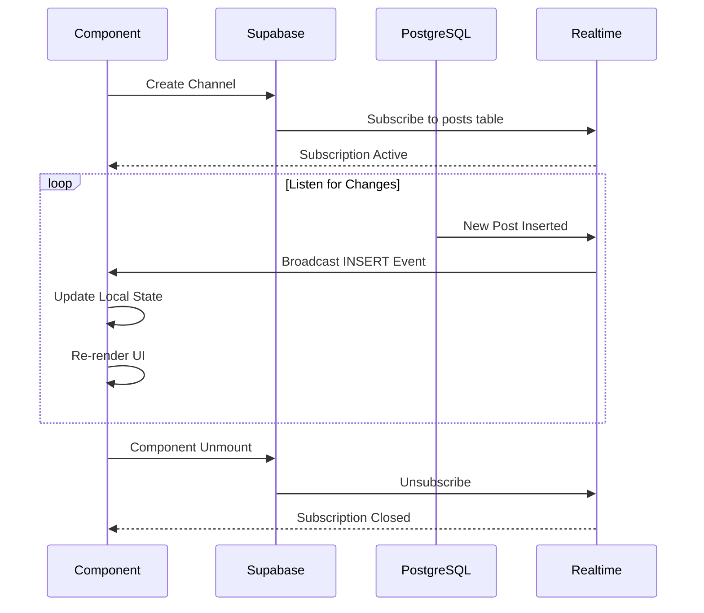
```mermaid
sequenceDiagram
    participant Component
    participant Supabase
    participant PostgreSQL
    participant Realtime

    Component->>Supabase: Create Channel
    Supabase->>Realtime: Subscribe to posts table
    Realtime-->>Component: Subscription Active
    
    loop Listen for Changes
        PostgreSQL->>Realtime: New Post Inserted
        Realtime->>Component: Broadcast INSERT Event
        Component->>Component: Update Local State
        Component->>Component: Re-render UI
    end
    
    Component->>Supabase: Component Unmount
    Supabase->>Realtime: Unsubscribe
    Realtime-->>Component: Subscription Closed
```

---

## Error Handling Flow

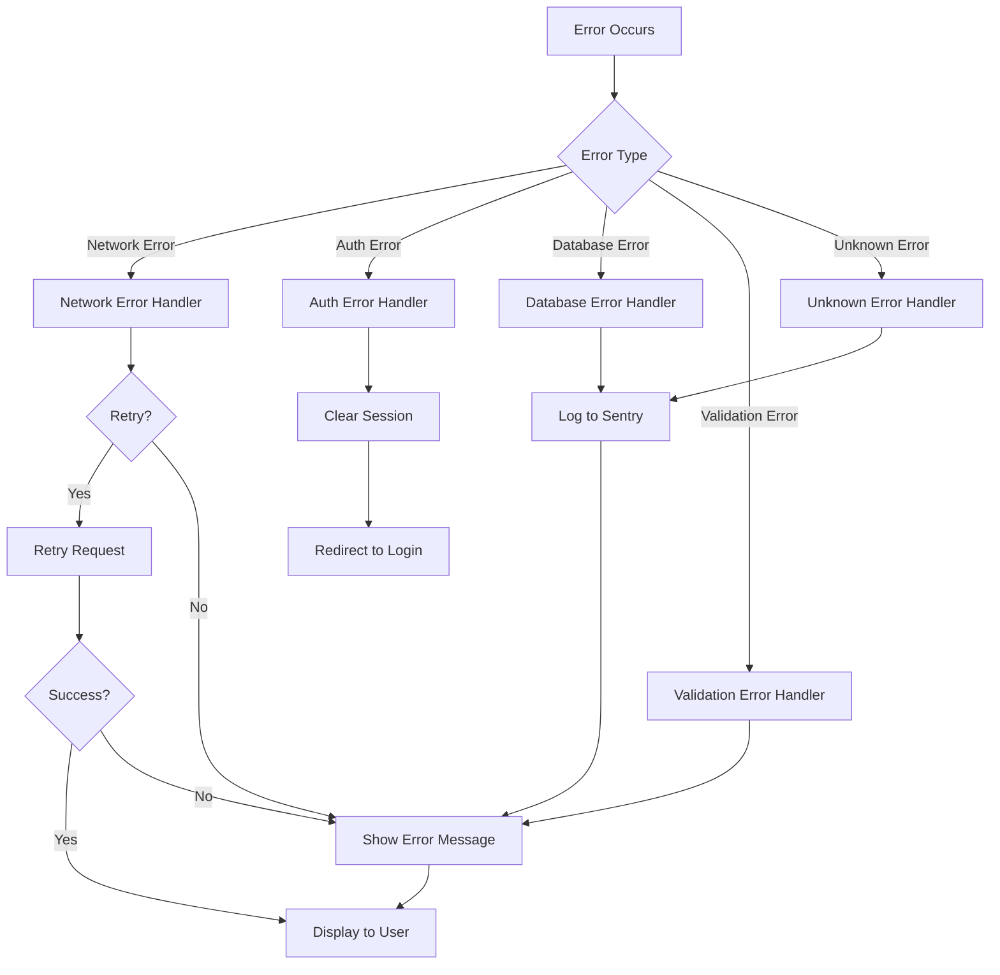
```mermaid
flowchart TD
    Error[Error Occurs] --> Type{Error Type}
    
    Type -->|Network Error| Network[Network Error Handler]
    Type -->|Auth Error| Auth[Auth Error Handler]
    Type -->|Database Error| Database[Database Error Handler]
    Type -->|Validation Error| Validation[Validation Error Handler]
    Type -->|Unknown Error| Unknown[Unknown Error Handler]
    
    Network --> Retry{Retry?}
    Retry -->|Yes| RetryRequest[Retry Request]
    Retry -->|No| ShowError[Show Error Message]
    
    Auth --> Logout[Clear Session]
    Logout --> Redirect[Redirect to Login]
    
    Database --> Log[Log to Sentry]
    Log --> ShowError
    
    Validation --> ShowError
    Unknown --> Log
    
    ShowError --> User[Display to User]
    RetryRequest --> Success{Success?}
    Success -->|Yes| User
    Success -->|No| ShowError
```

---

## Performance Optimization Strategy

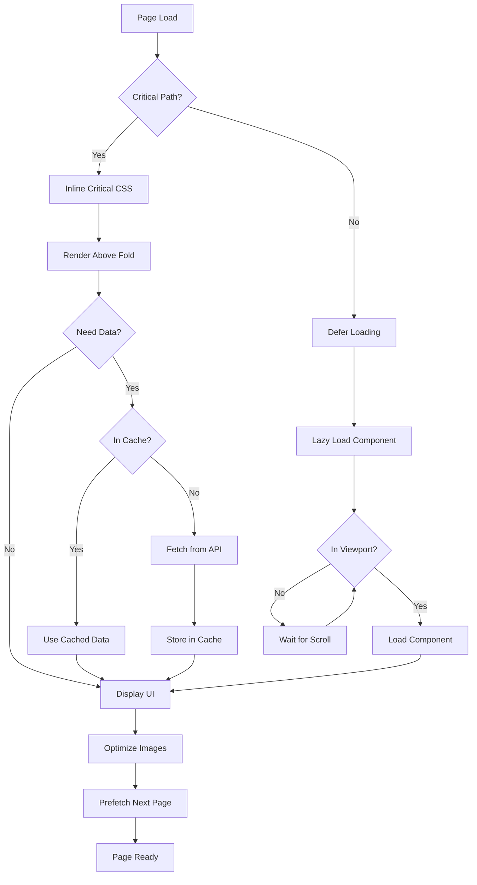
```mermaid
flowchart TD
    Start[Page Load] --> Critical{Critical Path?}
    
    Critical -->|Yes| Inline[Inline Critical CSS]
    Critical -->|No| Defer[Defer Loading]
    
    Inline --> Render[Render Above Fold]
    Defer --> Lazy[Lazy Load Component]
    
    Render --> Data{Need Data?}
    Data -->|Yes| Cache{In Cache?}
    Data -->|No| Display[Display UI]
    
    Cache -->|Yes| UseCache[Use Cached Data]
    Cache -->|No| Fetch[Fetch from API]
    
    UseCache --> Display
    Fetch --> StoreCache[Store in Cache]
    StoreCache --> Display
    
    Display --> Optimize[Optimize Images]
    Optimize --> Prefetch[Prefetch Next Page]
    Prefetch --> End[Page Ready]
    
    Lazy --> Viewport{In Viewport?}
    Viewport -->|Yes| Load[Load Component]
    Viewport -->|No| Wait[Wait for Scroll]
    
    Load --> Display
    Wait --> Viewport
```

---

## Monitoring & Observability

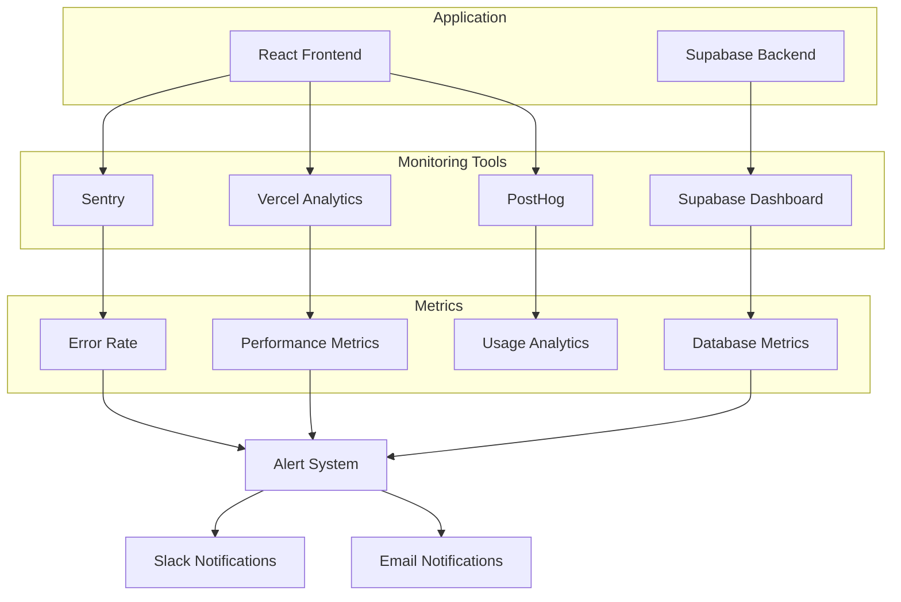
```mermaid
flowchart TD
    subgraph "Application"
        Frontend[React Frontend]
        Backend[Supabase Backend]
    end
    
    subgraph "Monitoring Tools"
        Sentry[Sentry]
        PostHog[PostHog]
        Vercel[Vercel Analytics]
        Supabase[Supabase Dashboard]
    end
    
    subgraph "Metrics"
        Errors[Error Rate]
        Performance[Performance Metrics]
        Usage[Usage Analytics]
        Database[Database Metrics]
    end
    
    Frontend --> Sentry
    Frontend --> PostHog
    Frontend --> Vercel
    Backend --> Supabase
    
    Sentry --> Errors
    PostHog --> Usage
    Vercel --> Performance
    Supabase --> Database
    
    Errors --> Alerts[Alert System]
    Performance --> Alerts
    Database --> Alerts
    
    Alerts --> Slack[Slack Notifications]
    Alerts --> Email[Email Notifications]
```

---

## Cost Structure

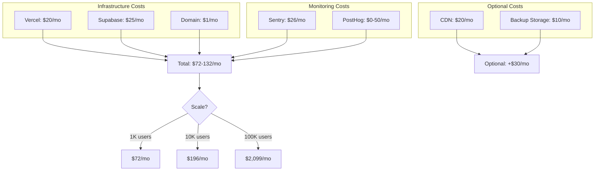
```mermaid
flowchart TD
    subgraph "Infrastructure Costs"
        Vercel[Vercel: $20/mo]
        Supabase[Supabase: $25/mo]
        Domain[Domain: $1/mo]
    end
    
    subgraph "Monitoring Costs"
        Sentry[Sentry: $26/mo]
        PostHog[PostHog: $0-50/mo]
    end
    
    subgraph "Optional Costs"
        CDN[CDN: $20/mo]
        Backup[Backup Storage: $10/mo]
    end
    
    Vercel --> Total[Total: $72-132/mo]
    Supabase --> Total
    Domain --> Total
    Sentry --> Total
    PostHog --> Total
    CDN --> Optional[Optional: +$30/mo]
    Backup --> Optional
    
    Total --> Scale{Scale?}
    Scale -->|1K users| Small[$72/mo]
    Scale -->|10K users| Medium[$196/mo]
    Scale -->|100K users| Large[$2,099/mo]
```

---

## Technology Stack

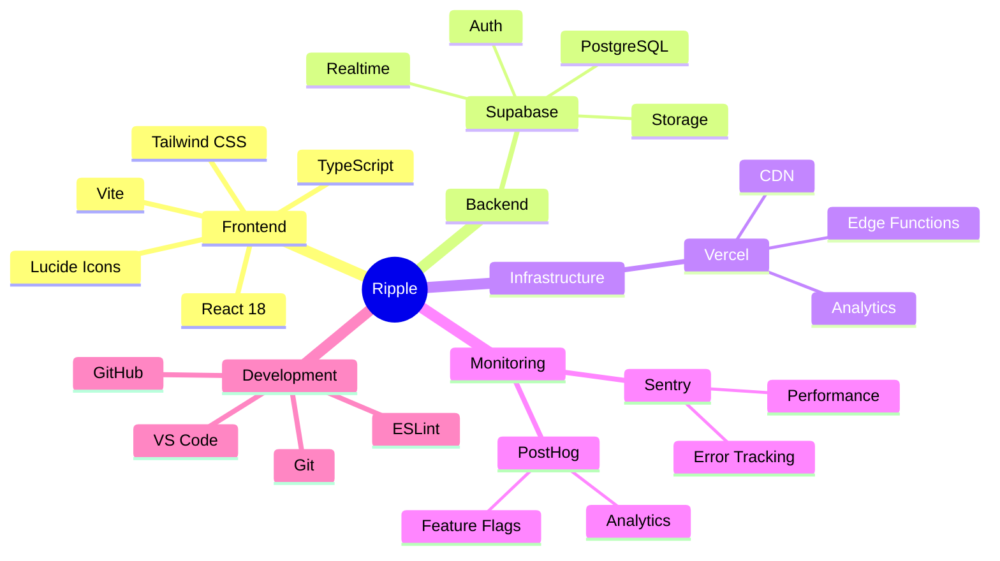
```mermaid
mindmap
  root((Ripple))
    Frontend
      React 18
      TypeScript
      Vite
      Tailwind CSS
      Lucide Icons
    Backend
      Supabase
        PostgreSQL
        Auth
        Storage
        Realtime
    Infrastructure
      Vercel
        CDN
        Edge Functions
        Analytics
    Monitoring
      Sentry
        Error Tracking
        Performance
      PostHog
        Analytics
        Feature Flags
    Development
      ESLint
      Git
      GitHub
      VS Code
```

---

## Future Architecture (Planned)

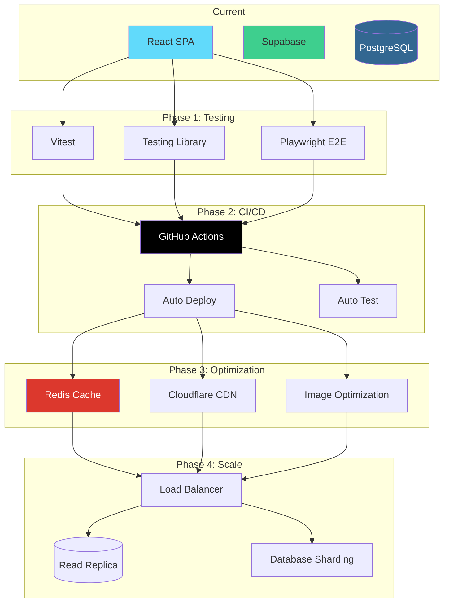
```mermaid
graph TB
    subgraph "Current"
        CurrentFE[React SPA]
        CurrentBE[Supabase]
        CurrentDB[(PostgreSQL)]
    end
    
    subgraph "Phase 1: Testing"
        Vitest[Vitest]
        TestingLib[Testing Library]
        E2E[Playwright E2E]
    end
    
    subgraph "Phase 2: CI/CD"
        GitHub[GitHub Actions]
        AutoDeploy[Auto Deploy]
        AutoTest[Auto Test]
    end
    
    subgraph "Phase 3: Optimization"
        Redis[Redis Cache]
        CDN[Cloudflare CDN]
        ImageOpt[Image Optimization]
    end
    
    subgraph "Phase 4: Scale"
        LoadBalancer[Load Balancer]
        ReadReplica[(Read Replica)]
        Sharding[Database Sharding]
    end
    
    CurrentFE --> Vitest
    CurrentFE --> TestingLib
    CurrentFE --> E2E
    
    Vitest --> GitHub
    TestingLib --> GitHub
    E2E --> GitHub
    
    GitHub --> AutoDeploy
    GitHub --> AutoTest
    
    AutoDeploy --> Redis
    AutoDeploy --> CDN
    AutoDeploy --> ImageOpt
    
    Redis --> LoadBalancer
    CDN --> LoadBalancer
    ImageOpt --> LoadBalancer
    
    LoadBalancer --> ReadReplica
    LoadBalancer --> Sharding
    
    style CurrentFE fill:#61dafb
    style CurrentBE fill:#3ecf8e
    style CurrentDB fill:#336791,color:#ffffff
    style GitHub fill:#000000,color:#ffffff
    style Redis fill:#dc382d,color:#ffffff
```

---

**Last Updated:** 2024-12-14  
**Maintained By:** Development Team  
**Next Review:** 2025-01-14
